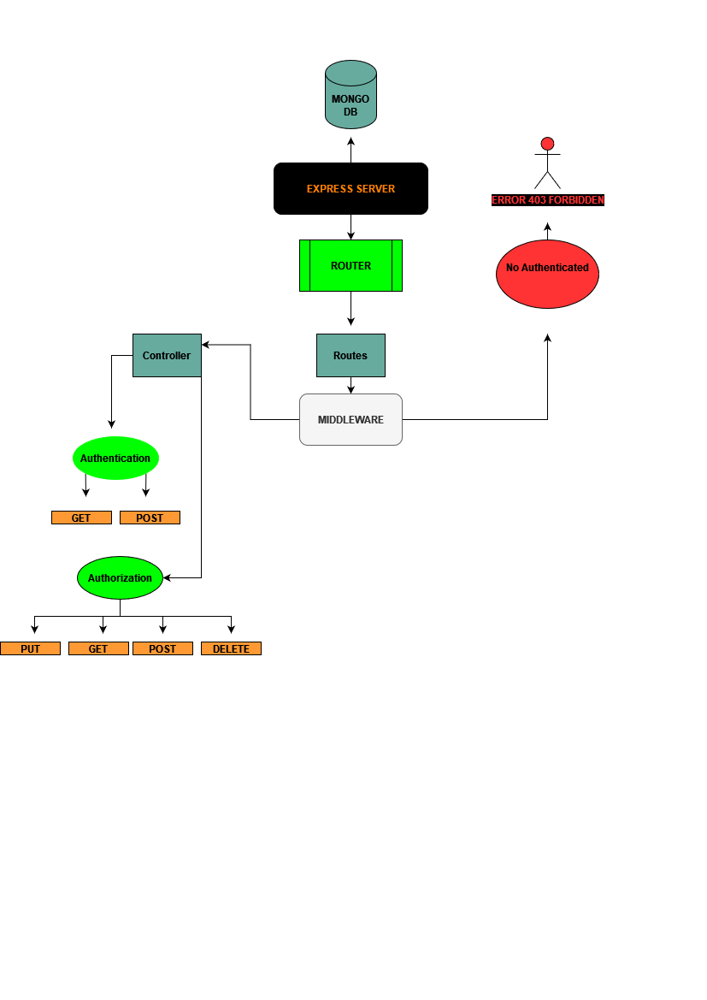
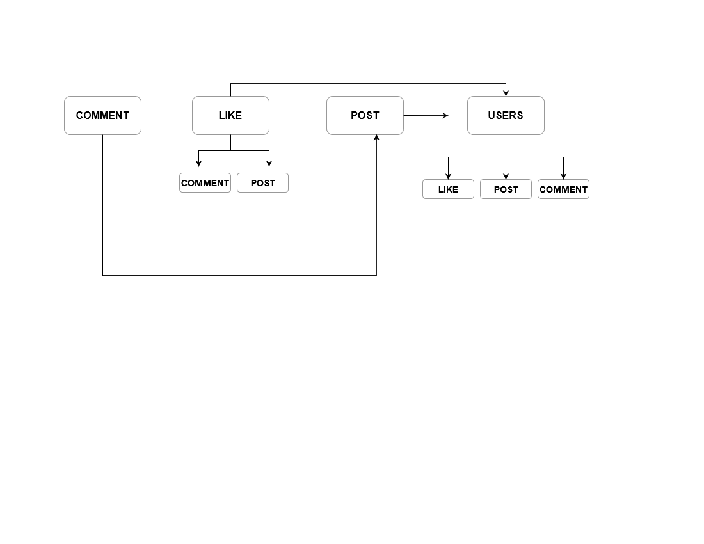

#  *<=== backend social Media website , standard edition   ===>*
## ==> packages => express , dotenv , jsonwebtoken , mongoose, morgan,bcrypt 
## ===> features create users registration, add Posts also authenticated user can add comment && likes to the posts also the user can delete and update there own post 
### =====> Also there only admins with full control access , with autherization to all controllers , in addition to that there is only one SuperUser or root whatever u named 
## oh too much /**/ of codes wr*** here lol ,
## <==> r0x <==> ##

